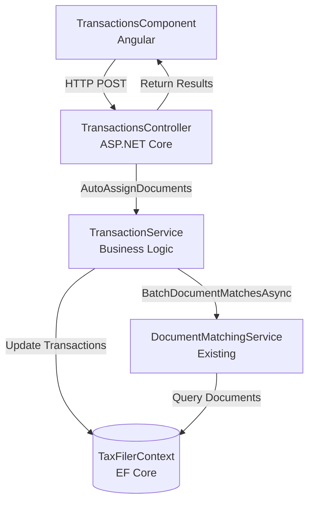
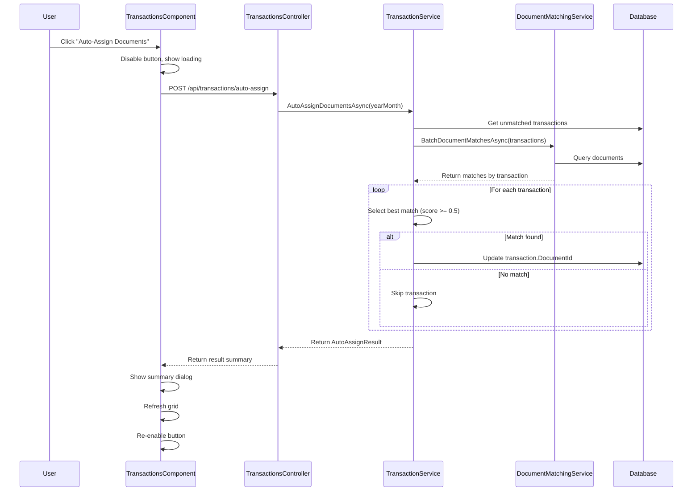

# Design Document

## Overview

The Bulk Auto-Assign Documents feature extends the existing transaction-document matching system by providing a batch operation that automatically assigns the best matching documents to unmatched transactions within a month view. The feature leverages the existing `DocumentMatchingService` and adds a new backend endpoint and frontend UI component to enable one-click bulk processing.

The design follows the existing TaxFiler architecture patterns:
- Backend: ASP.NET Core Web API with service layer
- Frontend: Angular with AG-Grid for data display
- Database: Entity Framework Core with PostgreSQL
- Error handling: FluentResults pattern
- Authentication: Azure AD/Entra ID

## Architecture

### Component Diagram



### Sequence Diagram



## Components and Interfaces

### Backend Components

#### 1. TransactionService Extension

Add new method to `ITransactionService`:

```csharp
public interface ITransactionService
{
    // ... existing methods ...
    
    /// <summary>
    /// Auto-assigns documents to unmatched transactions in a given month.
    /// </summary>
    /// <param name="yearMonth">The year-month to process</param>
    /// <param name="cancellationToken">Cancellation token</param>
    /// <returns>Result summary with counts of processed, assigned, and skipped transactions</returns>
    Task<AutoAssignResult> AutoAssignDocumentsAsync(
        DateOnly yearMonth, 
        CancellationToken cancellationToken = default);
}
```

Implementation in `TransactionService`:

```csharp
public async Task<AutoAssignResult> AutoAssignDocumentsAsync(
    DateOnly yearMonth, 
    CancellationToken cancellationToken = default)
{
    // 1. Query unmatched transactions for the month
    var unmatchedTransactions = await _context.Transactions
        .Where(t => t.TransactionDateTime.Year == yearMonth.Year 
                 && t.TransactionDateTime.Month == yearMonth.Month
                 && t.DocumentId == null)
        .ToListAsync(cancellationToken);
    
    // 2. Use batch matching to get candidates for all transactions
    var matchesByTransaction = await _documentMatchingService
        .BatchDocumentMatchesAsync(unmatchedTransactions, cancellationToken);
    
    // 3. Process each transaction and assign best match if score >= 0.5
    int assignedCount = 0;
    int skippedCount = 0;
    var errors = new List<string>();
    
    foreach (var transaction in unmatchedTransactions)
    {
        if (cancellationToken.IsCancellationRequested)
            break;
            
        try
        {
            if (matchesByTransaction.TryGetValue(transaction.Id, out var matches))
            {
                var bestMatch = matches.FirstOrDefault();
                
                if (bestMatch != null && bestMatch.MatchScore >= 0.5)
                {
                    transaction.DocumentId = bestMatch.Document.Id;
                    assignedCount++;
                }
                else
                {
                    skippedCount++;
                }
            }
            else
            {
                skippedCount++;
            }
        }
        catch (Exception ex)
        {
            errors.Add($"Transaction {transaction.Id}: {ex.Message}");
            skippedCount++;
            // Continue processing remaining transactions
        }
    }
    
    // 4. Save all changes in a single transaction
    if (assignedCount > 0)
    {
        await _context.SaveChangesAsync(cancellationToken);
    }
    
    // 5. Return summary
    return new AutoAssignResult
    {
        TotalProcessed = unmatchedTransactions.Count,
        AssignedCount = assignedCount,
        SkippedCount = skippedCount,
        Errors = errors
    };
}
```

#### 2. TransactionsController Extension

Add new endpoint to `TransactionsController`:

```csharp
/// <summary>
/// Auto-assigns documents to unmatched transactions in a given month.
/// </summary>
/// <param name="yearMonth">The year-month to process (format: yyyy-MM)</param>
/// <param name="cancellationToken">Cancellation token</param>
/// <returns>Summary of auto-assignment results</returns>
[HttpPost("auto-assign")]
[ProducesResponseType(typeof(AutoAssignResult), StatusCodes.Status200OK)]
[ProducesResponseType(StatusCodes.Status400BadRequest)]
[ProducesResponseType(StatusCodes.Status500InternalServerError)]
public async Task<ActionResult<AutoAssignResult>> AutoAssignDocuments(
    [FromQuery] DateOnly yearMonth,
    CancellationToken cancellationToken = default)
{
    try
    {
        var result = await transactionService.AutoAssignDocumentsAsync(
            yearMonth, 
            cancellationToken);
        
        return Ok(result);
    }
    catch (Exception ex)
    {
        return StatusCode(
            StatusCodes.Status500InternalServerError, 
            $"An error occurred during auto-assignment: {ex.Message}");
    }
}
```

### Frontend Components

#### 1. TransactionsComponent Extension

Add to `transactions.component.ts`:

```typescript
export class TransactionsComponent implements OnInit {
  // ... existing properties ...
  
  isAutoAssigning = false;
  autoAssignResult: AutoAssignResult | null = null;
  
  // ... existing methods ...
  
  async autoAssignDocuments(): Promise<void> {
    if (this.isAutoAssigning) {
      return;
    }
    
    this.isAutoAssigning = true;
    this.autoAssignResult = null;
    
    try {
      const url = `/api/transactions/auto-assign?yearMonth=${this.yearMonth}`;
      
      const result = await this.http.post<AutoAssignResult>(url, {}).toPromise();
      this.autoAssignResult = result;
      
      // Refresh the grid to show updated assignments
      this.getTransactions(this.yearMonth);
    } catch (error) {
      console.error('Error during auto-assignment:', error);
      alert('An error occurred during auto-assignment. Please try again.');
    } finally {
      this.isAutoAssigning = false;
    }
  }
  
  get hasUnmatchedTransactions(): boolean {
    // Check if there are any transactions without documents
    // This will be used to enable/disable the auto-assign button
    return this.transactions$?.pipe(
      map(txns => txns.some(t => !t.documentId))
    ) ?? false;
  }
  
  dismissAutoAssignResult(): void {
    this.autoAssignResult = null;
  }
}
```

#### 2. Template Updates

Add to `transactions.component.html`:

```html
<!-- Add button in the toolbar area -->
<button 
  mat-raised-button 
  color="primary"
  (click)="autoAssignDocuments()"
  [disabled]="isAutoAssigning || !hasUnmatchedTransactions"
  [matTooltip]="getAutoAssignTooltip()">
  <mat-icon *ngIf="isAutoAssigning">
    <mat-spinner diameter="20"></mat-spinner>
  </mat-icon>
  <mat-icon *ngIf="!isAutoAssigning">auto_fix_high</mat-icon>
  Auto-Assign Documents
</button>

<!-- Results dialog -->
<div *ngIf="autoAssignResult" class="auto-assign-result-dialog">
  <h3>Auto-Assignment Complete</h3>
  <p>Total transactions processed: {{ autoAssignResult.totalProcessed }}</p>
  <p>Successfully assigned: {{ autoAssignResult.assignedCount }}</p>
  <p>Skipped (no match): {{ autoAssignResult.skippedCount }}</p>
  <div *ngIf="autoAssignResult.errors.length > 0">
    <h4>Errors:</h4>
    <ul>
      <li *ngFor="let error of autoAssignResult.errors">{{ error }}</li>
    </ul>
  </div>
  <button mat-button (click)="dismissAutoAssignResult()">Close</button>
</div>
```

## Data Models

### AutoAssignResult

```csharp
namespace TaxFiler.Model.Dto;

/// <summary>
/// Result summary from bulk auto-assignment operation.
/// </summary>
public class AutoAssignResult
{
    /// <summary>
    /// Total number of unmatched transactions processed.
    /// </summary>
    public int TotalProcessed { get; set; }
    
    /// <summary>
    /// Number of transactions successfully assigned a document.
    /// </summary>
    public int AssignedCount { get; set; }
    
    /// <summary>
    /// Number of transactions skipped (no match above threshold).
    /// </summary>
    public int SkippedCount { get; set; }
    
    /// <summary>
    /// List of error messages for transactions that failed to process.
    /// </summary>
    public List<string> Errors { get; set; } = new();
}
```

TypeScript interface:

```typescript
export interface AutoAssignResult {
  totalProcessed: number;
  assignedCount: number;
  skippedCount: number;
  errors: string[];
}
```

## Correctness Properties

*A property is a characteristic or behavior that should hold true across all valid executions of a system—essentially, a formal statement about what the system should do. Properties serve as the bridge between human-readable specifications and machine-verifiable correctness guarantees.*

### Property Reflection

After analyzing the acceptance criteria, I've identified the following testable properties and eliminated redundancies:

**Redundancies identified:**
- Criteria 1.3 is redundant with 1.2 (processing only unassigned inherently means skipping assigned)
- Criteria 2.3 is redundant with 2.2 (no matches above threshold means nothing gets assigned)
- Criteria 5.2 is redundant with 3.3 (same requirement stated twice)

**Properties to implement:**

1. **Only unassigned transactions are processed** (1.2) - Property
2. **Threshold enforcement** (2.2) - Property
3. **Unconnected documents only** (2.4) - Property
4. **Processing order preservation** (3.2) - Property
5. **Error resilience** (3.3) - Property
6. **Data integrity on interruption** (6.4) - Property
7. **Button state based on unmatched transactions** (7.4) - Property

The remaining criteria are either examples (UI-specific behaviors) or edge cases that will be handled by the property test generators.

### Properties

**Property 1: Only unassigned transactions processed**
*For any* set of transactions containing both assigned and unassigned transactions, when auto-assignment is executed, only transactions with null DocumentId should be considered for processing.
**Validates: Requirements 1.2**

**Property 2: Threshold enforcement**
*For any* transaction and its matching documents, when the best match has a score below 0.5, the transaction's DocumentId should remain null after auto-assignment.
**Validates: Requirements 2.2**

**Property 3: Unconnected documents only**
*For any* auto-assignment operation, only documents that are not already assigned to other transactions should be considered as candidates for matching.
**Validates: Requirements 2.4**

**Property 4: Processing order preservation**
*For any* ordered list of transactions, the auto-assignment operation should process transactions in the same order they appear in the input list.
**Validates: Requirements 3.2**

**Property 5: Error resilience**
*For any* set of transactions where some fail to process, the auto-assignment operation should continue processing the remaining transactions and return results for all successfully processed ones.
**Validates: Requirements 3.3**

**Property 6: Data integrity on interruption**
*For any* auto-assignment operation that is cancelled or interrupted, no transaction should be left with a partially updated state (either fully updated or not updated at all).
**Validates: Requirements 5.4**

**Property 7: Button state based on unmatched transactions**
*For any* transaction list, the auto-assign button should be disabled if and only if all transactions have non-null DocumentId values.
**Validates: Requirements 6.4**

## Error Handling

### Backend Error Handling

1. **Transaction-level errors**: Catch exceptions during individual transaction processing, log the error, add to error list, and continue with remaining transactions
2. **Database errors**: Use EF Core transaction to ensure atomicity - either all updates succeed or none do
3. **Cancellation**: Respect `CancellationToken` to allow graceful shutdown
4. **Validation errors**: Return 400 Bad Request for invalid input parameters

### Frontend Error Handling

1. **Network errors**: Display user-friendly error message with retry option
2. **Timeout**: Set reasonable timeout (30 seconds) for the operation
3. **Navigation during processing**: Subscribe to route changes and cancel ongoing operation
4. **Empty result sets**: Disable button when no unmatched transactions exist

### Error Logging

- Log all errors to application logger with transaction ID and error details
- Include error messages in `AutoAssignResult.Errors` for user visibility
- Use structured logging for better diagnostics

## Testing Strategy

### Dual Testing Approach

This feature requires both unit tests and property-based tests to ensure comprehensive coverage:

- **Unit tests**: Verify specific examples, UI interactions, and edge cases
- **Property tests**: Verify universal properties across all inputs using randomized data

Both testing approaches are complementary and necessary for complete validation.

### Unit Testing

**Backend Unit Tests** (TaxFiler.Service.Test):
- Test `AutoAssignDocumentsAsync` with specific scenarios:
  - Empty transaction list
  - All transactions already assigned
  - Mix of assigned and unassigned transactions
  - Cancellation token triggered mid-operation
- Test error handling for individual transaction failures
- Test database transaction rollback on failure

**Frontend Unit Tests** (Angular Jasmine/Karma):
- Test button rendering and initial state
- Test button disabled state when no unmatched transactions
- Test loading indicator display during operation
- Test results dialog display and dismissal
- Test grid refresh after completion
- Test navigation cancellation

### Property-Based Testing

Use **FsCheck** (C#) for backend property tests and **fast-check** (TypeScript) for frontend property tests.

**Configuration**: Each property test should run a minimum of 100 iterations to ensure comprehensive input coverage.

**Backend Property Tests** (TaxFiler.Service.Test):

Each property test must include a comment tag referencing the design document:
```csharp
// Feature: bulk-auto-assign-documents, Property 1: Only unassigned transactions processed
```

1. **Property 1 Test**: Generate random transaction lists with mixed DocumentId states, verify only null DocumentId transactions are processed
2. **Property 2 Test**: Generate random transactions with various match scores, verify assignments only occur when score >= 0.5
3. **Property 3 Test**: Generate random document sets with mixed assignment states, verify only unconnected documents are used
4. **Property 4 Test**: Generate random ordered transaction lists, verify processing order matches input order
5. **Property 5 Test**: Inject random failures into transaction processing, verify remaining transactions are processed
6. **Property 6 Test**: Simulate random cancellations, verify no partial updates exist
7. **Property 7 Test**: Generate random transaction lists with various DocumentId states, verify button state logic

**Frontend Property Tests** (taxfiler.client):

Each property test must include a comment tag referencing the design document:
```typescript
// Feature: bulk-auto-assign-documents, Property 7: Button state based on unmatched transactions
```

1. **Property 7 Test**: Generate random transaction arrays, verify button disabled state matches presence of unmatched transactions

### Integration Testing

- End-to-end test: Upload transactions, run auto-assign, verify documents are assigned correctly
- Test with real database to ensure EF Core queries work as expected
- Test with concurrent operations to ensure no race conditions

### Edge Cases

- Very large transaction sets (100+ transactions)
- All transactions below match threshold
- No available documents to match
- Network interruption during operation
- User navigates away during processing
