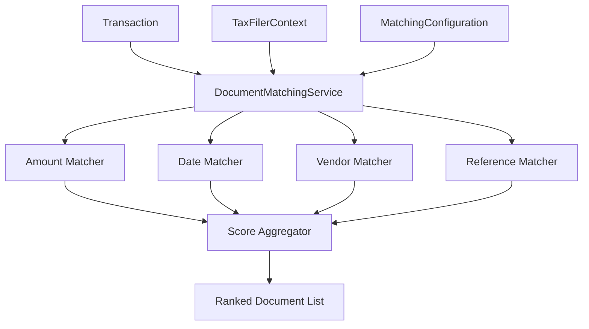

# Design Document: Enhanced Transaction Document Matching

## Overview

The Enhanced Transaction Document Matching system provides intelligent matching between financial transactions and supporting documents using a multi-criteria scoring algorithm. The system analyzes amount similarity, date proximity, vendor matching, and reference number correlation to generate confidence scores for potential matches.

The core component is a `DocumentMatchingService` that implements a `DocumentMatches` method, returning ranked lists of documents for given transactions. The service integrates with the existing TaxFiler architecture and leverages Entity Framework for data access.

## Architecture

### High-Level Architecture



### Service Layer Integration

The `DocumentMatchingService` integrates into the existing TaxFiler service layer:

- **TaxFiler.Service**: Contains the `IDocumentMatchingService` interface and `DocumentMatchingService` implementation
- **TaxFiler.Server**: Exposes matching functionality through API controllers
- **TaxFiler.DB**: Provides data access through the existing `TaxFilerContext`

## Components and Interfaces

### Core Service Interface

```csharp
public interface IDocumentMatchingService
{
    Task<IEnumerable<DocumentMatch>> DocumentMatchesAsync(Transaction transaction, CancellationToken cancellationToken = default);
    Task<IEnumerable<DocumentMatch>> DocumentMatchesAsync(int transactionId, CancellationToken cancellationToken = default);
    Task<Dictionary<int, IEnumerable<DocumentMatch>>> BatchDocumentMatchesAsync(IEnumerable<Transaction> transactions, CancellationToken cancellationToken = default);
}
```

### Document Match Result

```csharp
public class DocumentMatch
{
    public Document Document { get; set; }
    public double MatchScore { get; set; }
    public MatchScoreBreakdown ScoreBreakdown { get; set; }
}

public class MatchScoreBreakdown
{
    public double AmountScore { get; set; }
    public double DateScore { get; set; }
    public double VendorScore { get; set; }
    public double ReferenceScore { get; set; }
    public double CompositeScore { get; set; }
}
```

### Matching Configuration

```csharp
public class MatchingConfiguration
{
    public double AmountWeight { get; set; } = 0.40;
    public double DateWeight { get; set; } = 0.25;
    public double VendorWeight { get; set; } = 0.25;
    public double ReferenceWeight { get; set; } = 0.10;
    
    public double MinimumMatchScore { get; set; } = 0.3;
    public double BonusThreshold { get; set; } = 0.9;
    public double BonusMultiplier { get; set; } = 1.1;
    
    public AmountMatchingConfig AmountConfig { get; set; } = new();
    public DateMatchingConfig DateConfig { get; set; } = new();
    public VendorMatchingConfig VendorConfig { get; set; } = new();
}

public class AmountMatchingConfig
{
    public double ExactMatchTolerance { get; set; } = 0.01; // 1%
    public double HighMatchTolerance { get; set; } = 0.05;  // 5%
    public double MediumMatchTolerance { get; set; } = 0.10; // 10%
}

public class DateMatchingConfig
{
    public int ExactMatchDays { get; set; } = 0;
    public int HighMatchDays { get; set; } = 7;
    public int MediumMatchDays { get; set; } = 30;
}

public class VendorMatchingConfig
{
    public double FuzzyMatchThreshold { get; set; } = 0.8;
}
```

### Individual Matchers

```csharp
public interface IAmountMatcher
{
    double CalculateAmountScore(Transaction transaction, Document document, AmountMatchingConfig config);
}

public interface IDateMatcher
{
    double CalculateDateScore(Transaction transaction, Document document, DateMatchingConfig config);
}

public interface IVendorMatcher
{
    double CalculateVendorScore(Transaction transaction, Document document, VendorMatchingConfig config);
}

public interface IReferenceMatcher
{
    double CalculateReferenceScore(Transaction transaction, Document document);
}
```

## Data Models

### Enhanced Transaction Model Usage

The existing `Transaction` model provides these fields for matching:
- `GrossAmount`: Primary amount for comparison
- `TransactionDateTime`: Date for temporal matching
- `Counterparty`: Primary vendor/counterparty name
- `SenderReceiver`: Alternative vendor name field
- `TransactionReference`: Reference number for matching

### Enhanced Document Model Usage

The existing `Document` model provides these fields for matching:
- `Total`: Primary amount for comparison
- `SubTotal`: Alternative amount (before tax)
- `TaxAmount`: Tax component for amount calculations
- `Skonto`: Early payment discount consideration
- `InvoiceDate`: Primary date for matching
- `InvoiceDateFromFolder`: Fallback date field
- `VendorName`: Vendor name for matching
- `InvoiceNumber`: Reference number for matching

### String Similarity Utilities

```csharp
public static class StringSimilarity
{
    public static double LevenshteinSimilarity(string source, string target);
    public static double JaroWinklerSimilarity(string source, string target);
    public static bool ContainsIgnoreCase(string source, string target);
    public static string NormalizeForMatching(string input);
}
```

## Correctness Properties

*A property is a characteristic or behavior that should hold true across all valid executions of a system-essentially, a formal statement about what the system should do. Properties serve as the bridge between human-readable specifications and machine-verifiable correctness guarantees.*

After analyzing the acceptance criteria, several properties can be consolidated to eliminate redundancy. For example, individual amount tolerance properties (2.1-2.4) can be combined into a comprehensive amount scoring property, and similar consolidation applies to date and vendor matching properties.

### Property 1: Document Matching Returns Properly Ranked Results
*For any* transaction, the DocumentMatches method should return a list of documents ordered by Match_Score in descending order, with all scores between 0.0 and 1.0
**Validates: Requirements 1.1, 1.2, 6.4**

### Property 2: Empty Results for Poor Matches
*For any* transaction that has no documents meeting the minimum threshold, the system should return an empty list
**Validates: Requirements 1.3, 6.5**

### Property 3: Multi-Criteria Scoring Behavior
*For any* transaction and document pair, the composite Match_Score should be calculated using the configured weights for amount, date, vendor, and reference criteria
**Validates: Requirements 1.4, 6.1, 6.2**

### Property 4: Transaction Direction Independence
*For any* transaction regardless of IsOutgoing value, the matching algorithm should produce consistent scoring behavior
**Validates: Requirements 1.5**

### Property 5: Amount Scoring Tolerance Ranges
*For any* transaction and document pair, the amount score should correspond to the percentage difference between amounts (exact match = 1.0, within 5% = high score, within 10% = medium score, beyond 10% = low score)
**Validates: Requirements 2.1, 2.2, 2.3, 2.4**

### Property 6: Document Amount Field Handling
*For any* document with different combinations of SubTotal, Total, TaxAmount, and Skonto fields, the system should select the most appropriate amount for comparison
**Validates: Requirements 2.5, 2.6**

### Property 7: Date Proximity Scoring
*For any* transaction and document pair, the date score should correspond to the temporal distance between TransactionDateTime and document dates (exact = 1.0, within 7 days = high, within 30 days = medium, beyond 30 days = low)
**Validates: Requirements 3.1, 3.2, 3.3, 3.4**

### Property 8: Date Field Priority and Null Handling
*For any* document, the system should use InvoiceDate as primary and InvoiceDateFromFolder as fallback, handling null dates gracefully
**Validates: Requirements 3.5, 3.6**

### Property 9: Vendor Name Matching Hierarchy
*For any* transaction and document pair, vendor scoring should follow the hierarchy: exact match > substring match > reverse substring > fuzzy match > no match
**Validates: Requirements 4.1, 4.2, 4.3, 4.4, 4.5**

### Property 10: Multiple Vendor Field Usage
*For any* transaction, the system should consider both Counterparty and SenderReceiver fields when matching against document VendorName
**Validates: Requirements 4.6**

### Property 11: Reference Number Matching
*For any* transaction and document pair, reference scoring should follow the hierarchy: exact match > substring match > reverse substring > no match, ignoring case differences
**Validates: Requirements 5.1, 5.2, 5.3, 5.4, 5.5**

### Property 12: Bonus Score Application
*For any* match where an individual criterion scores above 0.9, the composite score should receive the configured bonus multiplier
**Validates: Requirements 6.3**

### Property 13: Batch Operation Consistency
*For any* collection of transactions, batch matching should produce the same results as individual matching operations
**Validates: Requirements 7.4**

### Property 14: Configuration Weight Effects
*For any* change in matching criterion weights, the relative ranking of document matches should reflect the new weight priorities
**Validates: Requirements 8.1, 8.2, 8.3**

### Property 15: Configuration Validation
*For any* configuration values outside acceptable ranges (negative weights, invalid thresholds), the system should reject the configuration and maintain current settings
**Validates: Requirements 8.4**

## Error Handling

### Database Connection Failures
- Service methods return `Result<T>` objects indicating success or failure
- Database timeouts are handled with appropriate retry logic
- Connection failures are logged and propagated as service errors

### Invalid Input Handling
- Null transactions are handled gracefully, returning empty results
- Invalid configuration values are validated and rejected
- Missing or corrupted document data is handled without crashing

### Performance Degradation
- Large document sets are processed in batches to prevent memory issues
- Query timeouts are configured to prevent indefinite blocking
- Caching is implemented to reduce database load for repeated operations

## Testing Strategy

### Dual Testing Approach
The system requires both unit tests and property-based tests for comprehensive coverage:

**Unit Tests** verify specific examples, edge cases, and error conditions:
- Specific matching scenarios with known expected results
- Edge cases like null values, empty strings, and boundary conditions
- Integration points between matchers and the main service
- Configuration validation and error handling

**Property Tests** verify universal properties across all inputs:
- Universal properties that hold for all transaction-document combinations
- Comprehensive input coverage through randomization using a property-based testing library
- Each property test runs minimum 100 iterations due to randomization

### Property-Based Testing Configuration
- **Library**: Use NUnit with FsCheck.NUnit for .NET property-based testing
- **Test Iterations**: Minimum 100 iterations per property test
- **Test Tagging**: Each property test references its design document property
- **Tag Format**: **Feature: enhanced-transaction-document-matching, Property {number}: {property_text}**

### Test Data Generation
- **Smart Generators**: Create generators that produce realistic transaction and document data
- **Constraint-Based**: Generate data within valid business ranges (positive amounts, reasonable dates)
- **Edge Case Coverage**: Include boundary values, null fields, and extreme scenarios
- **German Tax Context**: Generate data appropriate for German tax filing requirements

### Integration Testing
- Test with actual database connections using test containers
- Verify Entity Framework query generation and performance
- Test configuration loading and dependency injection
- Validate API controller integration and response formatting

<function_calls>
<invoke name="prework">
<parameter name="featureName">enhanced-transaction-document-matching