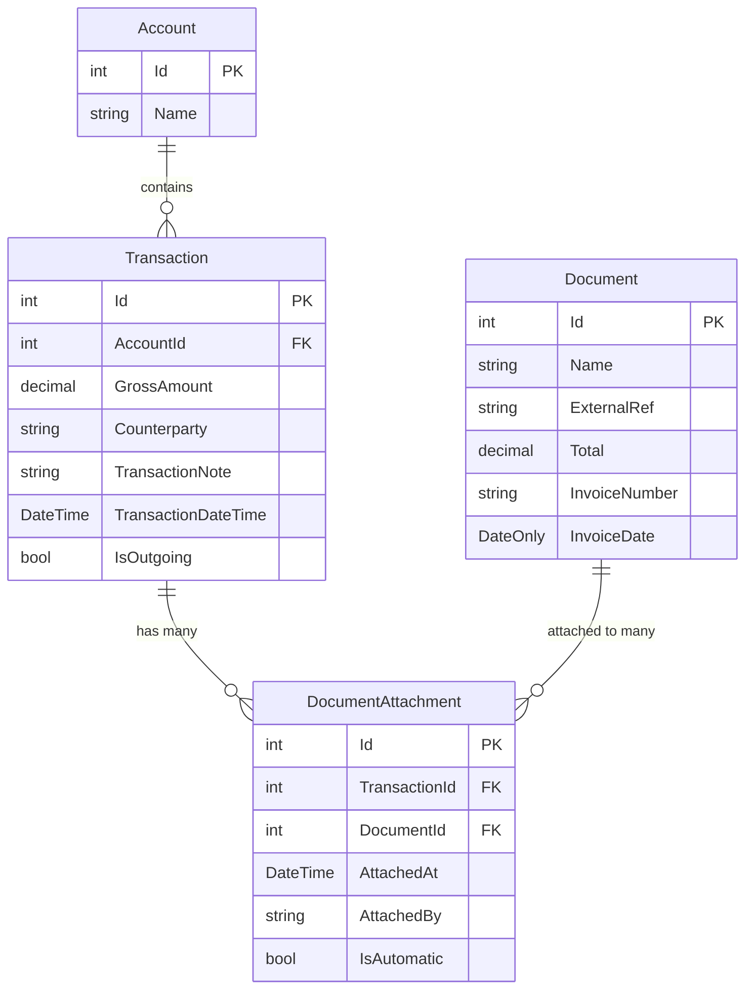

# Design Document: Multiple Document Attachments

## Overview

This design implements the capability to attach multiple documents to a single transaction in the TaxFiler application. The current system supports only one-to-one relationships between transactions and documents, which limits users when dealing with complex financial scenarios. This enhancement will modify the database schema, update matching algorithms, enhance the API, and improve the user interface to support one-to-many relationships.

The solution maintains backward compatibility with existing single document attachments while enabling new functionality for multiple attachments. The design leverages Entity Framework Core's relationship mapping capabilities and follows the existing clean architecture patterns used throughout the TaxFiler application.

## Architecture

### Current Architecture Analysis

The TaxFiler application follows a clean architecture pattern with clear separation of concerns:

- **TaxFiler.DB**: Entity Framework Core data layer with PostgreSQL/SQLite support
- **TaxFiler.Model**: Shared DTOs and domain objects
- **TaxFiler.Service**: Business logic and service implementations
- **TaxFiler.Server**: ASP.NET Core Web API controllers
- **taxfiler.client**: Angular 19 frontend with Angular Material

### Proposed Architecture Changes

The multiple document attachments feature will introduce a new junction entity to support many-to-many relationships while maintaining the existing service layer abstractions. The changes will be implemented across all layers:

1. **Database Layer**: New `DocumentAttachment` entity to manage relationships
2. **Service Layer**: Enhanced matching services and new attachment management services
3. **API Layer**: New endpoints for managing multiple attachments
4. **Frontend Layer**: Updated UI components to display and manage multiple documents

## Components and Interfaces

### Database Schema Changes

#### New Entity: DocumentAttachment

```csharp
public class DocumentAttachment
{
    [Key]
    public int Id { get; set; }
    
    [ForeignKey(nameof(Transaction))]
    public int TransactionId { get; set; }
    public Transaction Transaction { get; set; }
    
    [ForeignKey(nameof(Document))]
    public int DocumentId { get; set; }
    public Document Document { get; set; }
    
    public DateTime AttachedAt { get; set; }
    public string? AttachedBy { get; set; } // For audit trail
    public bool IsAutomatic { get; set; } // True if attached by matching algorithm
}
```

#### Updated Transaction Entity

```csharp
public class Transaction
{
    // ... existing properties ...
    
    // Remove the single DocumentId foreign key
    // [ForeignKey(nameof(Document))]
    // public int? DocumentId { get; set; }
    // public Document? Document { get; set; }
    
    // Add collection navigation property
    public ICollection<DocumentAttachment> DocumentAttachments { get; set; } = new List<DocumentAttachment>();
}
```

#### Updated Document Entity

```csharp
public class Document
{
    // ... existing properties ...
    
    // Add collection navigation property
    public ICollection<DocumentAttachment> DocumentAttachments { get; set; } = new List<DocumentAttachment>();
}
```

#### DbContext Updates

```csharp
public class TaxFilerContext : DbContext
{
    // ... existing DbSets ...
    
    public DbSet<DocumentAttachment> DocumentAttachments { get; set; }
    
    protected override void OnModelCreating(ModelBuilder modelBuilder)
    {
        // Configure many-to-many relationship
        modelBuilder.Entity<DocumentAttachment>()
            .HasOne(da => da.Transaction)
            .WithMany(t => t.DocumentAttachments)
            .HasForeignKey(da => da.TransactionId)
            .OnDelete(DeleteBehavior.Cascade);
            
        modelBuilder.Entity<DocumentAttachment>()
            .HasOne(da => da.Document)
            .WithMany(d => d.DocumentAttachments)
            .HasForeignKey(da => da.DocumentId)
            .OnDelete(DeleteBehavior.Cascade);
            
        // Ensure unique constraint on transaction-document pairs
        modelBuilder.Entity<DocumentAttachment>()
            .HasIndex(da => new { da.TransactionId, da.DocumentId })
            .IsUnique();
    }
}
```

### Service Layer Enhancements

#### New Interface: IDocumentAttachmentService

```csharp
public interface IDocumentAttachmentService
{
    Task<Result<IEnumerable<DocumentDto>>> GetAttachedDocumentsAsync(int transactionId);
    Task<Result> AttachDocumentAsync(int transactionId, int documentId, bool isAutomatic = false);
    Task<Result> DetachDocumentAsync(int transactionId, int documentId);
    Task<Result<AttachmentSummaryDto>> GetAttachmentSummaryAsync(int transactionId);
    Task<Result<IEnumerable<DocumentAttachment>>> GetAttachmentHistoryAsync(int transactionId);
}
```

#### Enhanced DocumentMatchingService

The existing `DocumentMatchingService` will be enhanced to support multiple document matching:

```csharp
public class DocumentMatchingService : IDocumentMatchingService
{
    // ... existing methods ...
    
    // New method for multiple document matching
    public async Task<IEnumerable<DocumentMatch>> FindMultipleDocumentMatchesAsync(
        Transaction transaction, 
        bool unconnectedOnly = true, 
        CancellationToken cancellationToken = default)
    {
        // Enhanced logic to find multiple matching documents
        // Parse voucher numbers from transaction notes
        // Sum amounts from multiple documents
        // Return ranked matches for multiple documents
    }
    
    // Enhanced auto-assignment for multiple documents
    public async Task<Result<MultipleAssignmentResult>> AutoAssignMultipleDocumentsAsync(
        int transactionId, 
        CancellationToken cancellationToken = default)
    {
        // Logic to automatically assign multiple documents
        // Validate total amounts don't exceed transaction amount
        // Create multiple DocumentAttachment records
    }
}
```

#### Enhanced ReferenceMatcher

```csharp
public class ReferenceMatcher : IReferenceMatcher
{
    // ... existing methods ...
    
    // New method to extract multiple voucher numbers
    public IEnumerable<string> ExtractVoucherNumbers(string transactionNote)
    {
        // Parse transaction notes for multiple voucher references
        // Handle common patterns: "INV001, INV002", "REF: 123, 456", etc.
        // Return list of extracted voucher numbers
    }
    
    // Enhanced scoring for multiple references
    public double CalculateMultipleReferenceScore(
        Transaction transaction, 
        IEnumerable<Document> documents)
    {
        // Calculate combined reference score for multiple documents
        // Consider partial matches and reference distribution
    }
}
```

#### Enhanced AmountMatcher

```csharp
public class AmountMatcher : IAmountMatcher
{
    // ... existing methods ...
    
    // New method for multiple document amount matching
    public double CalculateMultipleAmountScore(
        Transaction transaction, 
        IEnumerable<Document> documents, 
        AmountMatchingConfig config)
    {
        // Sum amounts from multiple documents
        // Compare with transaction amount
        // Handle Skonto calculations across multiple documents
        // Return composite score
    }
    
    // Validate total amounts don't exceed transaction
    public ValidationResult ValidateMultipleAmounts(
        decimal transactionAmount, 
        IEnumerable<Document> documents)
    {
        // Check if sum of document amounts is reasonable
        // Allow slight overages with warnings
        // Return validation result with recommendations
    }
}
```

### API Layer Changes

#### New DTOs

```csharp
public class AttachmentSummaryDto
{
    public int TransactionId { get; set; }
    public int AttachedDocumentCount { get; set; }
    public decimal TotalAttachedAmount { get; set; }
    public decimal TransactionAmount { get; set; }
    public decimal AmountDifference { get; set; }
    public bool HasAmountMismatch { get; set; }
    public IEnumerable<DocumentDto> AttachedDocuments { get; set; }
}

public class AttachDocumentRequestDto
{
    public int TransactionId { get; set; }
    public int DocumentId { get; set; }
}

public class MultipleAssignmentResult
{
    public int TransactionId { get; set; }
    public int DocumentsAttached { get; set; }
    public decimal TotalAmount { get; set; }
    public bool HasWarnings { get; set; }
    public IEnumerable<string> Warnings { get; set; }
    public IEnumerable<DocumentDto> AttachedDocuments { get; set; }
}
```

#### Updated TransactionDto

```csharp
public class TransactionDto
{
    // ... existing properties ...
    
    // Remove single document properties
    // public int? DocumentId { get; set; }
    // public DocumentDto? Document { get; set; }
    
    // Add multiple documents support
    public IEnumerable<DocumentDto> AttachedDocuments { get; set; } = new List<DocumentDto>();
    public int AttachedDocumentCount { get; set; }
    public decimal TotalAttachedAmount { get; set; }
    public bool HasAttachmentAmountMismatch { get; set; }
}
```

#### New Controller: DocumentAttachmentsController

```csharp
[Authorize]
[ApiController]
[Route("api/[controller]")]
public class DocumentAttachmentsController : ControllerBase
{
    private readonly IDocumentAttachmentService _attachmentService;
    
    [HttpGet("transaction/{transactionId}/documents")]
    public async Task<ActionResult<IEnumerable<DocumentDto>>> GetAttachedDocuments(int transactionId)
    
    [HttpPost("attach")]
    public async Task<ActionResult> AttachDocument(AttachDocumentRequestDto request)
    
    [HttpDelete("transaction/{transactionId}/document/{documentId}")]
    public async Task<ActionResult> DetachDocument(int transactionId, int documentId)
    
    [HttpGet("transaction/{transactionId}/summary")]
    public async Task<ActionResult<AttachmentSummaryDto>> GetAttachmentSummary(int transactionId)
    
    [HttpPost("transaction/{transactionId}/auto-assign")]
    public async Task<ActionResult<MultipleAssignmentResult>> AutoAssignMultipleDocuments(int transactionId)
}
```

#### Updated TransactionsController

```csharp
public class TransactionsController : ControllerBase
{
    // ... existing methods ...
    
    // Enhanced auto-assign to support multiple documents
    [HttpPost("auto-assign-multiple")]
    public async Task<ActionResult<IEnumerable<MultipleAssignmentResult>>> AutoAssignMultipleDocuments(
        [FromQuery] DateOnly yearMonth,
        CancellationToken cancellationToken = default)
    {
        // Process all transactions in the month
        // Assign multiple documents where appropriate
        // Return summary of assignments
    }
}
```

## Data Models

### Entity Relationship Diagram



### Migration Strategy

The database migration will preserve existing single document attachments by converting them to the new many-to-many structure:

```csharp
public partial class AddMultipleDocumentAttachments : Migration
{
    protected override void Up(MigrationBuilder migrationBuilder)
    {
        // Create new DocumentAttachments table
        migrationBuilder.CreateTable(
            name: "DocumentAttachments",
            columns: table => new
            {
                Id = table.Column<int>(type: "integer", nullable: false)
                    .Annotation("Npgsql:ValueGenerationStrategy", NpgsqlValueGenerationStrategy.IdentityByDefaultColumn),
                TransactionId = table.Column<int>(type: "integer", nullable: false),
                DocumentId = table.Column<int>(type: "integer", nullable: false),
                AttachedAt = table.Column<DateTime>(type: "timestamp with time zone", nullable: false),
                AttachedBy = table.Column<string>(type: "text", nullable: true),
                IsAutomatic = table.Column<bool>(type: "boolean", nullable: false)
            },
            constraints: table =>
            {
                table.PrimaryKey("PK_DocumentAttachments", x => x.Id);
                table.ForeignKey(
                    name: "FK_DocumentAttachments_Documents_DocumentId",
                    column: x => x.DocumentId,
                    principalTable: "Documents",
                    principalColumn: "Id",
                    onDelete: ReferentialAction.Cascade);
                table.ForeignKey(
                    name: "FK_DocumentAttachments_Transactions_TransactionId",
                    column: x => x.TransactionId,
                    principalTable: "Transactions",
                    principalColumn: "Id",
                    onDelete: ReferentialAction.Cascade);
            });

        // Migrate existing single document attachments
        migrationBuilder.Sql(@"
            INSERT INTO ""DocumentAttachments"" (""TransactionId"", ""DocumentId"", ""AttachedAt"", ""IsAutomatic"")
            SELECT ""Id"", ""DocumentId"", NOW(), true
            FROM ""Transactions""
            WHERE ""DocumentId"" IS NOT NULL
        ");

        // Create unique index
        migrationBuilder.CreateIndex(
            name: "IX_DocumentAttachments_TransactionId_DocumentId",
            table: "DocumentAttachments",
            columns: new[] { "TransactionId", "DocumentId" },
            unique: true);

        // Remove old DocumentId column from Transactions (in separate migration for safety)
        // This will be done in a follow-up migration after validation
    }
}
```

## Correctness Properties

*A property is a characteristic or behavior that should hold true across all valid executions of a system-essentially, a formal statement about what the system should do. Properties serve as the bridge between human-readable specifications and machine-verifiable correctness guarantees.*

Now I need to analyze the acceptance criteria from the requirements to create correctness properties. Let me use the prework tool:

<function_calls>
<invoke name="prework">
<parameter name="featureName">multiple-document-attachments

### Property Reflection

After analyzing all acceptance criteria, I identified several areas where properties can be consolidated to eliminate redundancy:

**Database and Migration Properties**: Properties 1.1-1.5 and 6.1-6.5 can be consolidated since they all test database schema correctness and migration integrity. The core property is ensuring the many-to-many relationship works correctly.

**API Endpoint Properties**: Properties 3.1-3.6 can be consolidated into comprehensive API contract testing since they all verify the same endpoints behave correctly under different conditions.

**Matching Algorithm Properties**: Properties 2.1-2.5 can be consolidated since they all test the enhanced matching logic for multiple documents.

**Validation Properties**: Properties 5.1-5.5 can be consolidated since they all test business rule validation around attachments.

**Performance Properties**: Properties 7.1, 7.2, 7.4, 7.5 can be consolidated since they all test system efficiency with multiple attachments.

### Correctness Properties

Based on the prework analysis and property reflection, here are the consolidated correctness properties:

**Property 1: Database Schema Integrity**
*For any* transaction and set of documents, the system should support attaching multiple documents through the DocumentAttachment entity while maintaining referential integrity when transactions or documents are deleted
**Validates: Requirements 1.1, 1.2, 1.3, 1.4, 1.5**

**Property 2: Migration Data Preservation**
*For any* existing transaction with a single document attachment, the migration process should preserve the attachment in the new many-to-many format without data loss
**Validates: Requirements 6.1, 6.2, 6.3, 6.4, 6.5**

**Property 3: Multiple Document Matching**
*For any* transaction with multiple voucher numbers in the notes or multiple documents whose amounts sum to the transaction amount, the matching service should identify and attach all relevant documents while prioritizing exact matches
**Validates: Requirements 2.1, 2.2, 2.3, 2.4, 2.5**

**Property 4: Document Attachment API Contract**
*For any* valid transaction and document combination, the attachment API should correctly attach documents, retrieve attachments, and detach documents while returning appropriate HTTP status codes and maintaining data integrity
**Validates: Requirements 3.1, 3.2, 3.3, 3.4, 3.5, 3.6**

**Property 5: Amount Calculation Accuracy**
*For any* transaction with multiple attached documents, the system should correctly calculate the total attached amount and identify discrepancies with the transaction amount
**Validates: Requirements 4.5, 4.6**

**Property 6: Business Rule Validation**
*For any* attachment operation, the system should prevent duplicate attachments, validate user permissions, warn about amount mismatches, and maintain complete audit trails
**Validates: Requirements 5.1, 5.2, 5.3, 5.4, 5.5**

**Property 7: Performance and Scalability**
*For any* transaction with multiple attachments, the system should load all attachment data efficiently using optimized queries and support pagination for large attachment lists
**Validates: Requirements 7.1, 7.2, 7.4, 7.5**

## Error Handling

### Database Errors

- **Constraint Violations**: Handle unique constraint violations when attempting to attach the same document to a transaction multiple times
- **Foreign Key Violations**: Gracefully handle attempts to attach non-existent documents or attach to non-existent transactions
- **Migration Failures**: Provide rollback capability and detailed error reporting for migration issues

### Business Logic Errors

- **Amount Validation**: Warn users when total attached document amounts significantly exceed transaction amounts, but allow the attachment
- **Permission Validation**: Return appropriate error codes when users attempt to attach documents they don't have access to
- **Duplicate Detection**: Warn users when attaching documents that are already attached to other transactions

### API Error Responses

```csharp
public class AttachmentErrorResponse
{
    public string ErrorCode { get; set; }
    public string Message { get; set; }
    public Dictionary<string, object> Details { get; set; }
}

// Example error codes:
// DOCUMENT_NOT_FOUND, TRANSACTION_NOT_FOUND, DUPLICATE_ATTACHMENT
// AMOUNT_MISMATCH_WARNING, PERMISSION_DENIED, VALIDATION_FAILED
```

### Matching Algorithm Error Handling

- **Timeout Handling**: Implement cancellation tokens and timeout handling for long-running matching operations
- **Invalid Data Handling**: Gracefully handle documents with missing or invalid amount data
- **Reference Parsing Errors**: Continue matching even if voucher number parsing fails for some transaction notes

## Testing Strategy

### Dual Testing Approach

The testing strategy combines unit tests for specific scenarios and property-based tests for comprehensive coverage:

**Unit Tests**: Focus on specific examples, edge cases, and integration points:
- Specific migration scenarios with known data sets
- API endpoint behavior with known inputs
- Error conditions and boundary cases
- Integration between matching services and attachment services

**Property-Based Tests**: Verify universal properties across all inputs:
- Database schema integrity with randomly generated transactions and documents
- Matching algorithm correctness with various transaction note patterns
- API contract compliance with diverse input combinations
- Amount calculation accuracy across different document amount combinations

### Property-Based Testing Configuration

- **Testing Library**: Use FsCheck.NUnit for .NET property-based testing
- **Test Iterations**: Minimum 100 iterations per property test to ensure comprehensive coverage
- **Test Data Generation**: Custom generators for transactions, documents, and attachment scenarios
- **Shrinking**: Leverage FsCheck's shrinking capabilities to find minimal failing examples

### Test Organization

```csharp
[TestFixture]
public class MultipleDocumentAttachmentsPropertyTests
{
    [Property(Iterations = 100)]
    [Tag("Feature: multiple-document-attachments, Property 1: Database Schema Integrity")]
    public Property DatabaseSchemaIntegrity(Transaction transaction, List<Document> documents)
    {
        // Test that multiple documents can be attached and referential integrity is maintained
    }
    
    [Property(Iterations = 100)]
    [Tag("Feature: multiple-document-attachments, Property 3: Multiple Document Matching")]
    public Property MultipleDocumentMatching(Transaction transaction, List<Document> documents)
    {
        // Test that matching algorithm correctly identifies multiple relevant documents
    }
    
    // Additional property tests for each correctness property...
}
```

### Integration Testing

- **Database Integration**: Test with both PostgreSQL and SQLite to ensure compatibility
- **API Integration**: Test complete request/response cycles with realistic data
- **Matching Service Integration**: Test end-to-end matching scenarios with complex transaction notes
- **Migration Integration**: Test migration process with various existing data scenarios

### Performance Testing

- **Load Testing**: Test system performance with transactions having many attached documents
- **Query Performance**: Verify that database queries remain efficient with large datasets
- **Matching Performance**: Ensure matching algorithms complete within reasonable time limits
- **Memory Usage**: Monitor memory consumption during bulk attachment operations

The testing strategy ensures that both specific scenarios are validated through unit tests and general correctness is verified through property-based testing, providing comprehensive coverage of the multiple document attachments feature.