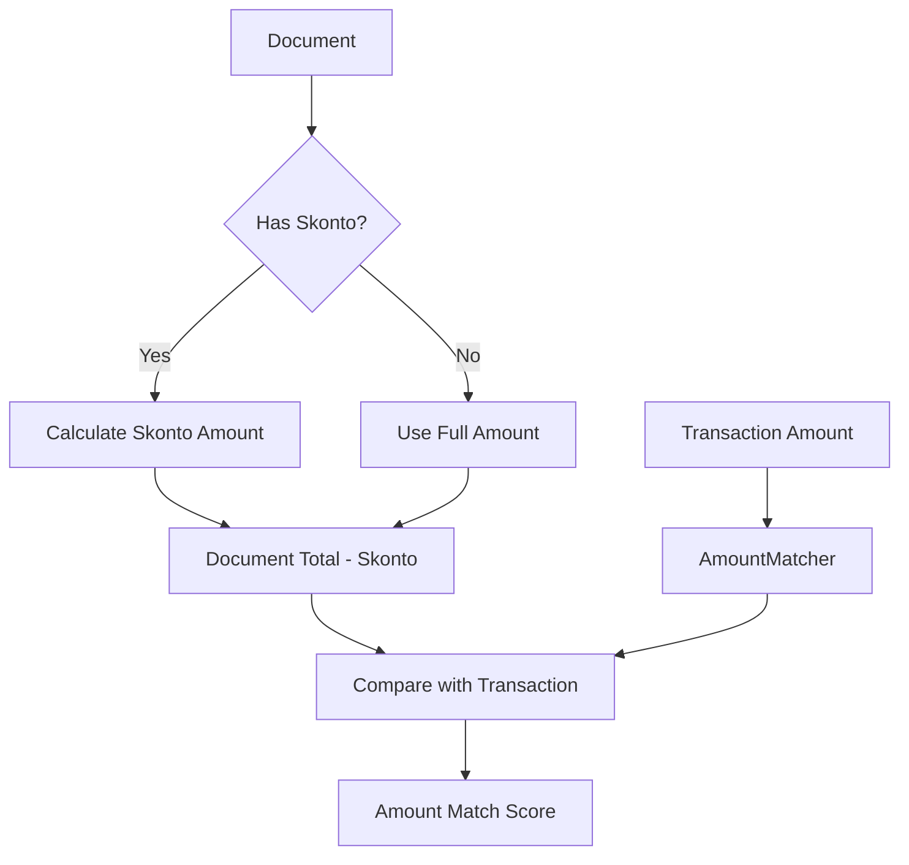

# Design Document: Skonto-Aware Transaction Matching

## Overview

The Skonto-Aware Transaction Matching system enhances the existing TaxFiler document matching functionality to properly handle early payment discounts (Skonto). When documents contain Skonto percentage terms, the system calculates the discounted amount and uses it for transaction matching instead of the full document amount.

The enhancement modifies the existing `AmountMatcher` component to detect Skonto terms and apply percentage-based discounts before performing amount comparisons. This ensures accurate matching when users take advantage of early payment discounts.

## Architecture

### Enhanced Amount Matching Flow



### Integration with Existing System

The Skonto-aware matching integrates seamlessly with the existing document matching architecture:

- **TaxFiler.Service**: Enhanced `AmountMatcher` class with Skonto calculation logic
- **TaxFiler.DB**: Uses existing `Document.Skonto` field for percentage values
- **Existing API**: No changes to public interfaces or response formats

## Components and Interfaces

### Enhanced AmountMatcher Interface

```csharp
public interface IAmountMatcher
{
    double CalculateAmountScore(Transaction transaction, Document document, AmountMatchingConfig config);
}
```

The existing interface remains unchanged to maintain backward compatibility.

### Skonto Calculation Logic

```csharp
public static class SkontoCalculator
{
    public static decimal CalculateDiscountedAmount(decimal documentTotal, decimal? skontoPercentage)
    {
        if (!skontoPercentage.HasValue || skontoPercentage.Value <= 0)
            return documentTotal;
            
        var discountAmount = documentTotal * (skontoPercentage.Value / 100m);
        return documentTotal - discountAmount;
    }
    
    public static bool HasValidSkonto(decimal? skontoPercentage)
    {
        return skontoPercentage.HasValue && skontoPercentage.Value > 0;
    }
}
```

### Enhanced AmountMatcher Implementation

```csharp
public class AmountMatcher : IAmountMatcher
{
    public double CalculateAmountScore(Transaction transaction, Document document, AmountMatchingConfig config)
    {
        var documentAmount = GetDocumentAmount(document);
        var transactionAmount = GetTransactionAmount(transaction);
        
        // Apply Skonto if present
        if (SkontoCalculator.HasValidSkonto(document.Skonto))
        {
            documentAmount = SkontoCalculator.CalculateDiscountedAmount(documentAmount, document.Skonto);
        }
        
        return CalculateAmountMatchScore(transactionAmount, documentAmount, config);
    }
    
    private decimal GetDocumentAmount(Document document)
    {
        // Priority: Total > SubTotal + TaxAmount > SubTotal
        if (document.Total.HasValue && document.Total.Value > 0)
            return document.Total.Value;
            
        if (document.SubTotal.HasValue && document.SubTotal.Value > 0)
        {
            var taxAmount = document.TaxAmount ?? 0;
            return document.SubTotal.Value + taxAmount;
        }
        
        return document.SubTotal ?? 0;
    }
    
    private decimal GetTransactionAmount(Transaction transaction)
    {
        return Math.Abs(transaction.GrossAmount);
    }
    
    private double CalculateAmountMatchScore(decimal transactionAmount, decimal documentAmount, AmountMatchingConfig config)
    {
        if (documentAmount == 0) return 0.0;
        
        var difference = Math.Abs(transactionAmount - documentAmount);
        var percentageDifference = (double)(difference / documentAmount);
        
        if (percentageDifference <= config.ExactMatchTolerance)
            return 1.0;
        else if (percentageDifference <= config.HighMatchTolerance)
            return 0.8;
        else if (percentageDifference <= config.MediumMatchTolerance)
            return 0.5;
        else
            return 0.1;
    }
}
```

## Data Models

### Document Model Usage

The existing `Document` model provides the `Skonto` field:
- `Skonto`: Decimal field containing the percentage discount (e.g., 2.0 for 2%)
- `Total`: Primary amount for comparison
- `SubTotal`: Alternative amount (before tax)
- `TaxAmount`: Tax component for amount calculations

### Transaction Model Usage

The existing `Transaction` model provides:
- `GrossAmount`: The actual paid amount (after Skonto deduction)

## Correctness Properties

*A property is a characteristic or behavior that should hold true across all valid executions of a system-essentially, a formal statement about what the system should do. Properties serve as the bridge between human-readable specifications and machine-verifiable correctness guarantees.*

### Property 1: Skonto Amount Calculation
*For any* document with a valid Skonto percentage, the discounted amount should equal the document total minus the percentage-based discount
**Validates: Requirements 1.1, 1.2**

### Property 2: Skonto-Adjusted Matching
*For any* document with Skonto terms, the amount matching should use the discounted amount instead of the full document amount
**Validates: Requirements 1.1**

### Property 3: Backward Compatibility for Non-Skonto Documents
*For any* document without Skonto terms (null or zero), the amount matching should behave identically to the original implementation
**Validates: Requirements 1.3**

### Property 4: Skonto Scoring Behavior
*For any* transaction and document pair where the transaction amount matches the Skonto-adjusted amount within tolerance, the system should assign an appropriate match score
**Validates: Requirements 1.4**

### Property 5: Edge Case Handling
*For any* document with null or zero Skonto percentage, the system should handle it gracefully and fall back to standard amount matching
**Validates: Requirements 1.5**

## Error Handling

### Invalid Skonto Values
- Null or zero Skonto percentages are treated as "no Skonto" and use standard matching
- Negative Skonto percentages are treated as invalid and ignored
- Skonto percentages over 100% are capped at 100% to prevent negative amounts

### Calculation Edge Cases
- Zero document amounts are handled gracefully, returning zero match score
- Very small amounts (< 0.01) use absolute difference instead of percentage difference
- Rounding errors in decimal calculations are handled with appropriate tolerance

### Integration Failures
- Missing document fields fall back to alternative amount sources
- Database connection issues are handled by the existing service layer
- Configuration errors use default tolerance values

## Testing Strategy

### Dual Testing Approach
The system requires both unit tests and property-based tests for comprehensive coverage:

**Unit Tests** verify specific examples, edge cases, and error conditions:
- Specific Skonto calculation scenarios with known expected results
- Edge cases like null values, zero percentages, and boundary conditions
- Integration with existing amount matching logic
- Backward compatibility verification

**Property Tests** verify universal properties across all inputs:
- Universal properties that hold for all document-transaction combinations
- Comprehensive input coverage through randomization using a property-based testing library
- Each property test runs minimum 100 iterations due to randomization

### Property-Based Testing Configuration
- **Library**: Use NUnit with FsCheck.NUnit for .NET property-based testing
- **Test Iterations**: Minimum 100 iterations per property test
- **Test Tagging**: Each property test references its design document property
- **Tag Format**: **Feature: skonto-aware-transaction-matching, Property {number}: {property_text}**

### Test Data Generation
- **Smart Generators**: Create generators that produce realistic transaction and document data with various Skonto scenarios
- **Constraint-Based**: Generate data within valid business ranges (positive amounts, reasonable Skonto percentages 0-10%)
- **Edge Case Coverage**: Include boundary values, null fields, and extreme scenarios
- **German Tax Context**: Generate data appropriate for German tax filing requirements with typical Skonto terms

### Integration Testing
- Test with actual database connections using existing TaxFiler test infrastructure
- Verify Entity Framework query generation and performance impact
- Test configuration loading and dependency injection
- Validate API controller integration maintains existing response formats

<function_calls>
<invoke name="prework">
<parameter name="featureName">skonto-aware-transaction-matching